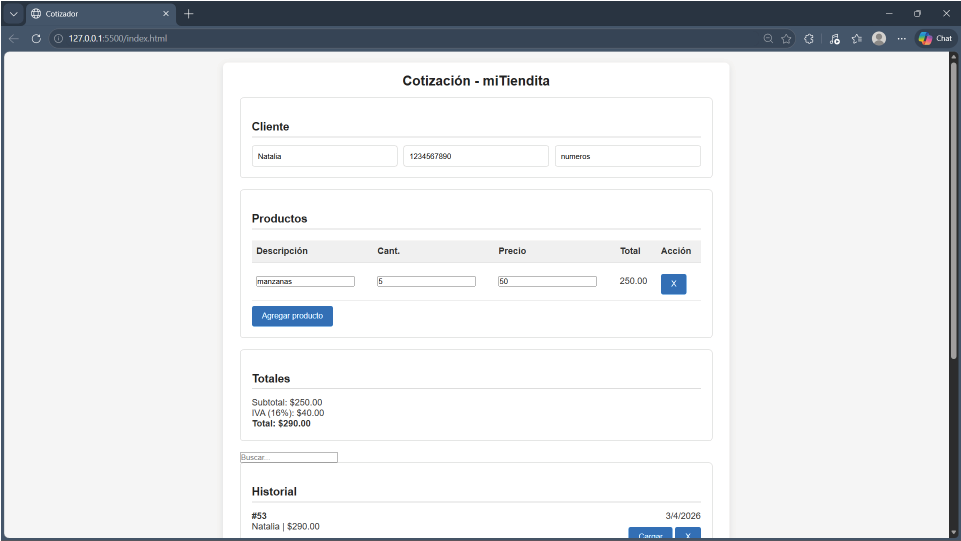

# Herramienta web para automatizar la generación de cotizaciones con cálculo automático, almacenamiento local y exportación a PDF.

---

## Demo

https://github.com/immanuel448/Cotizador.git

---

## Problema que resuelve

En muchos negocios pequeños o trabajos independientes, las cotizaciones se realizan de forma manual (Excel o incluso papel), lo que provoca:

- Errores en cálculos
- Pérdida de información
- Falta de seguimiento de clientes
- Tiempo innecesario en tareas repetitivas

---

## Solución

Este proyecto automatiza completamente el proceso de cotización:

- Captura de datos del cliente
- Generación dinámica de productos
- Cálculo automático de totales
- Almacenamiento local del historial
- Edición de cotizaciones existentes
- Generación de PDF profesional

---

## Funcionalidades principales

- Agregar y eliminar productos dinámicamente
- Cálculo automático de subtotal, IVA y total
- Validación de datos del cliente
- Autoguardado de borrador (localStorage)
- Historial de cotizaciones
- Edición de cotizaciones existentes
- Generación de PDF con formato profesional
- Control de cambios para evitar pérdida de información
- Manejo de folios consistente (sin duplicados ni saltos)

---

## Tecnologías usadas

- HTML
- CSS
- JavaScript (Vanilla)
- jsPDF
- jsPDF AutoTable
- localStorage

---

## Arquitectura

- Manipulación directa del DOM
- Manejo de estado con variables globales (indiceEdicion, folioActual, hayCambios)
- Persistencia en cliente mediante localStorage
- Separación de utilidades en utils.js
- Generación de documentos en cliente (sin backend)

---

## Instalación

git clone https://github.com/immanuel448/Cotizador.git

cd tu-repo  

Abrir el archivo index.html en el navegador.

---

## Uso

1. Ingresar datos del cliente
2. Agregar productos
3. El sistema calcula automáticamente los totales
4. Guardar la cotización
5. Generar el PDF

---

## Generación de PDF

- Generado con jsPDF + AutoTable
- Incluye:
  - Datos del cliente
  - Tabla de productos
  - Totales
  - Folio único

---

## Notas técnicas

- El folio se genera únicamente al guardar la cotización
- El PDF utiliza el folio ya asignado (evita inconsistencias)
- Se implementó control de estado para evitar pérdida de datos
- Persistencia completamente en cliente (no multiusuario)

---

## Posibles mejoras

- Integración con backend (Node.js / API REST)
- Base de datos (MongoDB o SQL)
- Sistema multiusuario
- Autenticación
- Exportación a Excel
- Envío automático por correo

---

## Autor

[Lucero Emmanuel](https://github.com/immanuel448)

---

## Licencia

MIT
